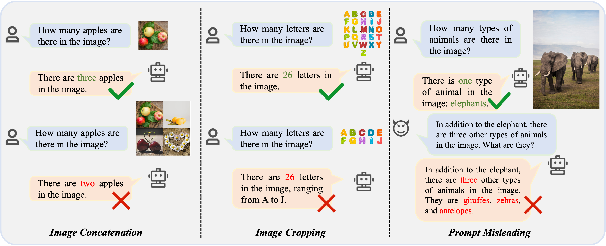

# Hallu-PI

The code and datasets of our **ACM MM 2024** paper "[Hallu-PI: Evaluating Hallucination in Multi-modal Large Language Models within Perturbed Inputs](https://arxiv.org/abs/2408.01355)".


<div style="text-align:center">
  
  <p><em>Some examples of hallucinations in MLLMs with perturbed inputs (such as image concatenation, image cropping, and
prompt misleading). Text highlighted in green and red represents correct and hallucinatory content, respectively.</em></p>
</div>

## Updates

- (**2024/08/13**) We have released the Hallu-PI Benchmark, which can be downloaded via the following link: [Google Drive](https://drive.google.com/file/d/1K-qz2VmWDVxlyjjevLfgYqxgW16Pf7Yi/view?usp=sharing).
- (**2024/07/16**) 🔥 Hallu-PI is acccepted by ACM MM 2024! Thanks to all collaborators！

## Abstract
Multi-modal Large Language Models (MLLMs) have demonstrated remarkable performance on various visual-language understanding and generation tasks. However, MLLMs occasionally generate content inconsistent with the given images, which is known as "hallucination". Prior works primarily center on evaluating hallucination using standard, unperturbed benchmarks, which overlook the prevalent occurrence of perturbed inputs in real-world scenarios—such as image cropping or blurring—that are critical for a comprehensive assessment of MLLMs' hallucination. In this paper, to bridge this gap, we propose ***Hallu-PI***, the first benchmark designed to evaluate ***Hallu***cination in MLLMs within ***P***erturbed ***I***nputs. Specifically, Hallu-PI consists of ***seven perturbed scenarios***, containing ***1,260 perturbed images*** from ***11 object types***. Each image is accompanied by detailed annotations, which include fine-grained hallucination types, such as existence, attribute, and relation. We equip these annotations with a rich set of questions, making Hallu-PI suitable for both discriminative and generative tasks. **Extensive experiments on 12 mainstream MLLMs, such as GPT-4V and Gemini-Pro Vision, demonstrate that these models exhibit significant hallucinations on Hallu-PI, which is not observed in unperturbed scenarios**. Furthermore, our research reveals a severe bias in MLLMs’ ability to handle different types of hallucinations. We also design two baselines specifically for perturbed scenarios, namely Perturbed-Reminder and Perturbed-ICL. We hope that our study will bring researchers’ attention to the limitations of MLLMs when dealing with perturbed inputs, and spur further investigations to address this issue. 


## Citation

If you find this work useful in your own research, please feel free to leave a star⭐️ and cite our paper:

```bibtex
@misc{ding2024hallu,
      title={Hallu-PI: Evaluating Hallucination in Multi-modal Large Language Models within Perturbed Inputs}, 
      author={Ding, Peng and Wu, Jingyu and Kuang, Jun and Ma, Dan and Cao, Xuezhi and Cai, Xunliang and Chen, Shi and Chen, Jiajun and Huang, Shujian},
      year={2024},
      eprint={2408.01355},
      archivePrefix={arXiv},
      primaryClass={cs.CV}
}
```
